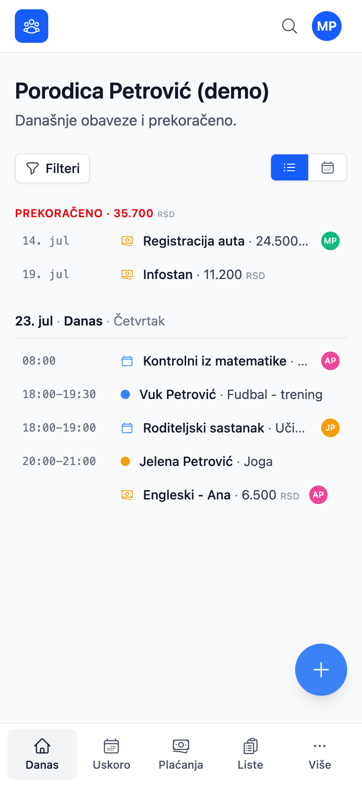
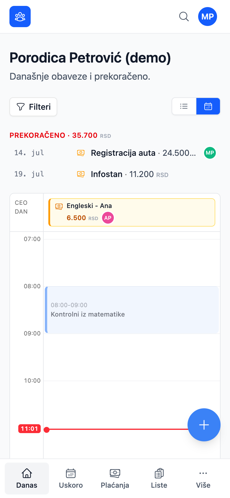
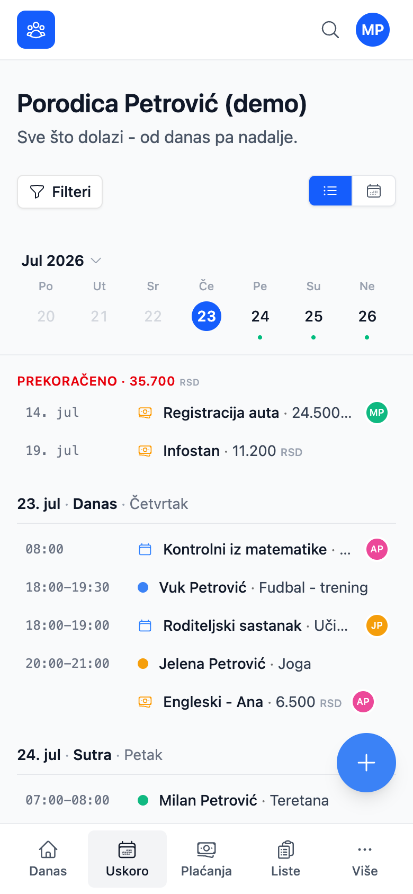
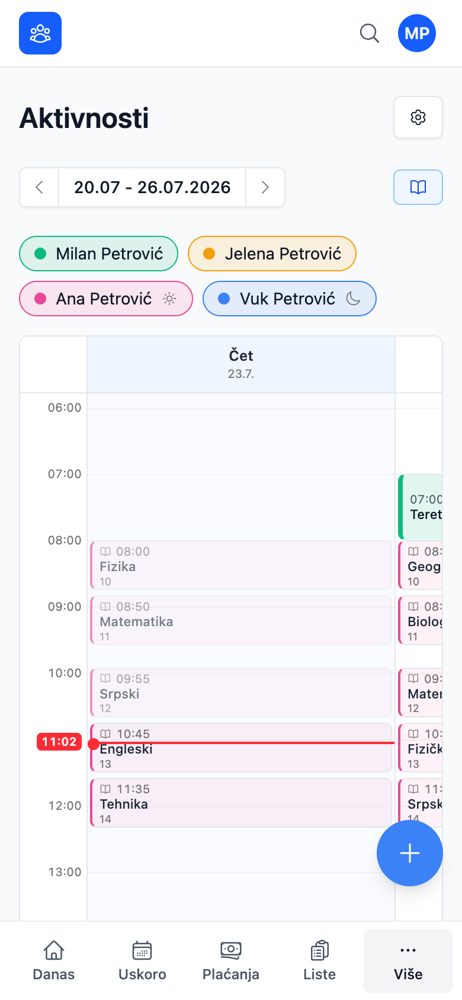
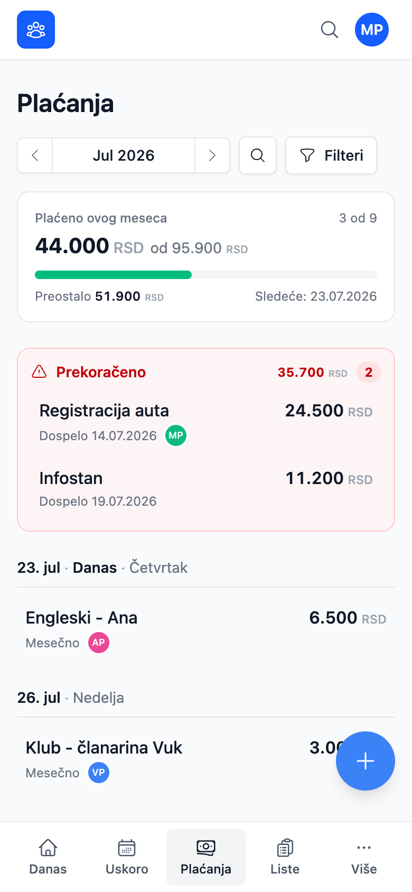
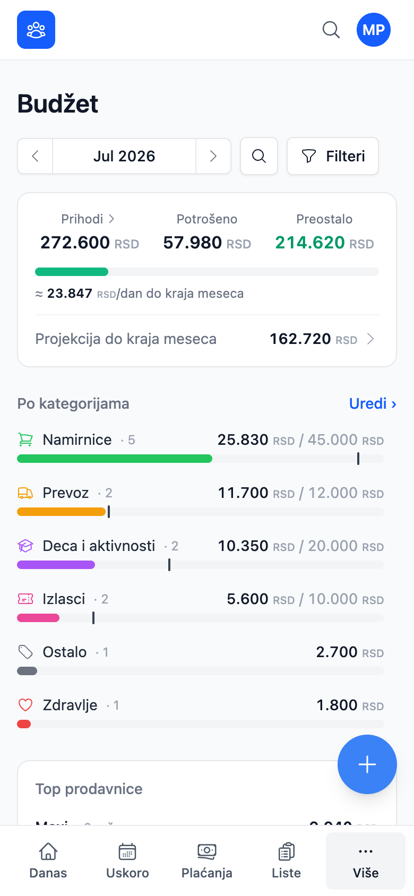
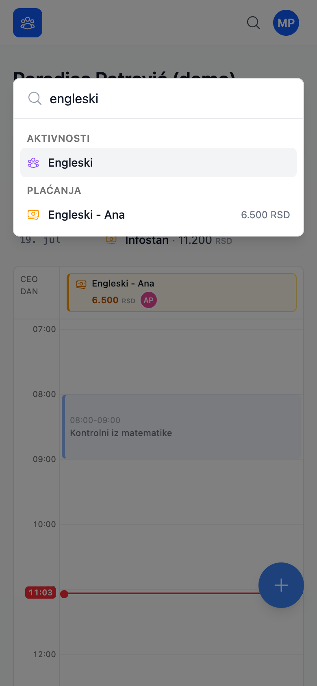

# Porodični asistent

[](https://github.com/pajcho/family-assistant-react/actions/workflows/deploy.yml)

**Porodični asistent** je mobile-first PWA za vođenje porodičnog dana na jednom mestu:
aktivnosti dece, školski raspored, događaji, računi, budžet i zajedničke liste.
Sve na srpskom, sa push podsetnicima i realtime sinhronizacijom među članovima porodice.

**▶ Aplikacija: [pajcho.github.io/family-assistant-react](https://pajcho.github.io/family-assistant-react/)**
(privatna instanca - potreban je nalog u okviru porodice)

|                     Danas                      |                  Dnevni kalendar                  |                     Uskoro                     |
| :--------------------------------------------: | :-----------------------------------------------: | :--------------------------------------------: |
|            |  |          |
|             **Aktivnosti i škola**             |                   **Plaćanja**                    |                   **Budžet**                   |
|  |         |          |
|                   **Liste**                    |               **Globalna pretraga**               |                 **Tamna tema**                 |
|            |         |  |

## Mogućnosti

- 📅 **Jedinstvena agenda (Danas / Uskoro)** - aktivnosti, događaji, plaćanja, rođendani i
  Google eventi u jednom toku. Prikaz kao lista ili kalendar, filteri po tipu i po članu,
  a sve što je propušteno stoji na vrhu u sekciji „Prekoračeno".
- 🎒 **Aktivnosti i školski raspored** - ponavljajući termini (nedeljno, A/B nedelje, na N nedelja),
  učesnici po članu, plus školske smene sa automatskim preokretanjem, raspored časova (varijanta A/B)
  i zvona koja same računaju vreme svakog časa.
- 💳 **Plaćanja** - jednokratna i ponavljajuća (mesečno, nedeljno, ograničen broj rata),
  varijabilan iznos, pauziranje, podsetnici N dana ranije, kao i povezivanje sa aktivnošću,
  događajem ili rođendanom („koliko nas zapravo košta Engleski").
- 💱 **Više valuta** - iznos u EUR ili USD se pri unosu prevodi po zvaničnom
  srednjem kursu NBS-a i **zamrzava** zajedno sa kursom, pa se istorija nikad ne prevodi ponovo.
- 📊 **Budžet** - kategorije sa mesečnim limitima, prihodi, projekcija do kraja meseca,
  top prodavnice i trend potrošnje. Trošak se dodaje ručno ili **skeniranjem fiskalnog QR koda**
  (zxing-wasm u browseru, pa dovlačenje stavki računa).
- 📝 **Liste** - porodične i lične, u realnom vremenu. Swipe akcije, drag-and-drop redosled,
  markdown opisi i „smart sort" koji šoping listu sam grupiše po odeljenjima prodavnice.
- 🎂 **Rođendani** - godine, koliko dana je ostalo i vezivanje poklona kao plaćanja.
- 🔔 **Web Push** - jutarnji i večernji digest po podešenom vremenu i vremenskoj zoni,
  podsetnici pred događaj i instant obaveštenje kad neko od ukućana nešto doda.
  Idempotentno preko `notification_log`, mrtve pretplate se same brišu.
- 📆 **Google kalendar** - jednosmerno preslikavanje (read-only) sa privatnošću po kalendaru:
  ne deli se, deli se samo termin bez detalja, ili se deli ceo događaj.
- 🔍 **Globalna pretraga** (⌘K) kroz aktivnosti, događaje, plaćanja, liste i rođendane.
- 📱 **PWA** - instalira se na telefon, radi u standalone režimu, ima tamnu temu i
  toast kad stigne nova verzija.

## Tehnologija

- **Frontend:** Vite · React 19 · TypeScript (strict) · TanStack Router (file-based) ·
  TanStack Query · Tailwind v4 · shadcn/ui (Radix) - statika na **GitHub Pages**
- **Backend:** **Supabase** - Postgres sa RLS na svakoj tabeli (izolacija po porodici),
  Auth, Realtime (`postgres_changes` → `invalidateQueries`) i Edge Functions (Deno)
- **Poslovi u pozadini:** `pg_cron` + Edge Functions - `send-due-pushes` (svakog minuta),
  `gcal-sync`, `receipt-import`, `exchange-rate`
- **Alati:** Oxc (`oxlint` + `oxfmt`), Vitest (188 testova), `vite-plugin-pwa` sa
  sopstvenim service workerom (`injectManifest`)

## Pokretanje

```bash
pnpm install
pnpm dev         # http://localhost:5173
pnpm test        # Vitest
pnpm typecheck   # tsc -b
pnpm check       # oxfmt --check + oxlint + provera crtica (pokreni pre PR-a)
pnpm build       # produkcioni build + 404.html/.nojekyll za GH Pages
```

Kopiraj `.env.example` u `.env` i popuni `VITE_SUPABASE_URL` i `VITE_SUPABASE_ANON_KEY`.
Za lokalni razvoj nad `supabase start` instancom koristi `.env.local`.

**Porodica i nalozi:**

```bash
pnpm setup-family        # kreira porodicu i naloge (interaktivno, nad .env)
pnpm setup-family:local  # isto, nad lokalnom Supabase instancom
```

Za lokalno testiranje postoji i skripta koja ubacuje kompletnu **demo porodicu**
(izmišljena imena, realni podaci kroz sve module) pored postojećih podataka:

```bash
pnpm exec tsx --env-file=.env.local scripts/seed-demo.ts
```

Skripta odbija da se pokrene nad bilo čim osim lokalnog Supabase-a i pri svakom
pokretanju iznova pravi demo porodicu. Screenshotovi iznad su snimljeni nad njom.

## Dokumentacija

- [AGENTS.md](AGENTS.md) - pravila za AI agente koji rade na repozitorijumu
  (pre svega: nikad dugačka crtica, pa konvencije oko jezika i labela dugmadi)

## Deploy

**Frontend** ide automatski: svaki push na `main` builda i deployuje na GitHub Pages
(`.github/workflows/deploy.yml`). Production base path je `/family-assistant-react/`,
a build pravi i `404.html` pa SPA rute rade bez hash-a. `VITE_SUPABASE_URL` i
`VITE_SUPABASE_ANON_KEY` se ubacuju iz repo secrets.

**Backend se ne deployuje sam.** Izmene baze i edge funkcija idu ručno:

```bash
supabase db push
supabase functions deploy <ime-funkcije>
```

## Status

Aplikacija je u svakodnevnoj upotrebi. Migracija sa Nuxt-a je odavno gotova, a od tada
su isporučeni događaji i plaćanja, agenda sa kalendarskim prikazima, budžet sa fiskalnim
QR skenerom, više valuta i redizajn formi za brzi unos. Sledi dalje UX poliranje.
