# Family Assistant

**Family Assistant** is a mobile-first PWA for running a family's day in one place:
the children's activities, the school timetable, events, bills, the budget and shared lists.
The interface is in Serbian, with push reminders and realtime sync between family members.

**▶ App: [pajcho.github.io/family-assistant-react](https://pajcho.github.io/family-assistant-react/)**
(a private instance - an account inside the family is required)

|                    Today                     |                        Week                         |                      Month                      |
| :------------------------------------------: | :-------------------------------------------------: | :---------------------------------------------: |
|     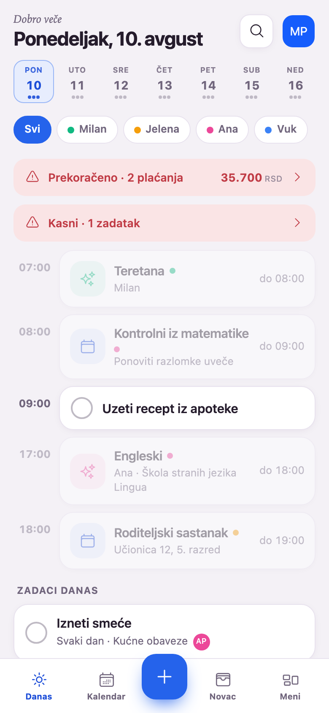     |   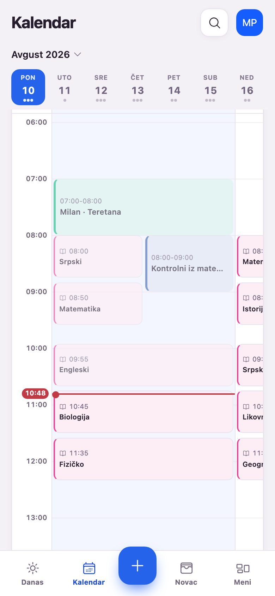    |  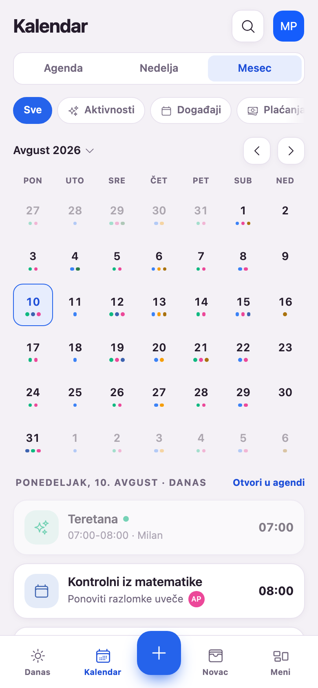  |
|                  **Budget**                  |                    **Payments**                     |                    **Lists**                    |
|    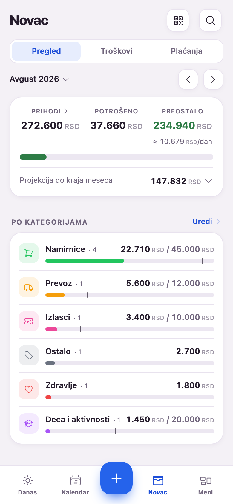    |     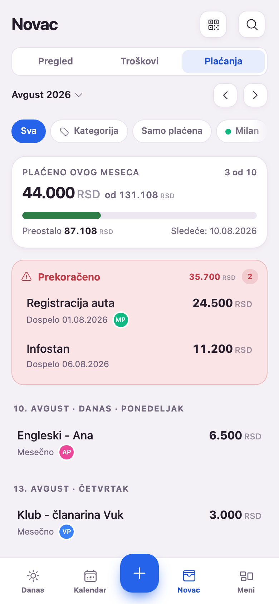      |      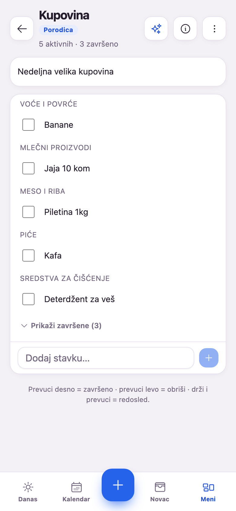       |
|                  **School**                  |                      **Menu**                       |                **Global search**                |
|    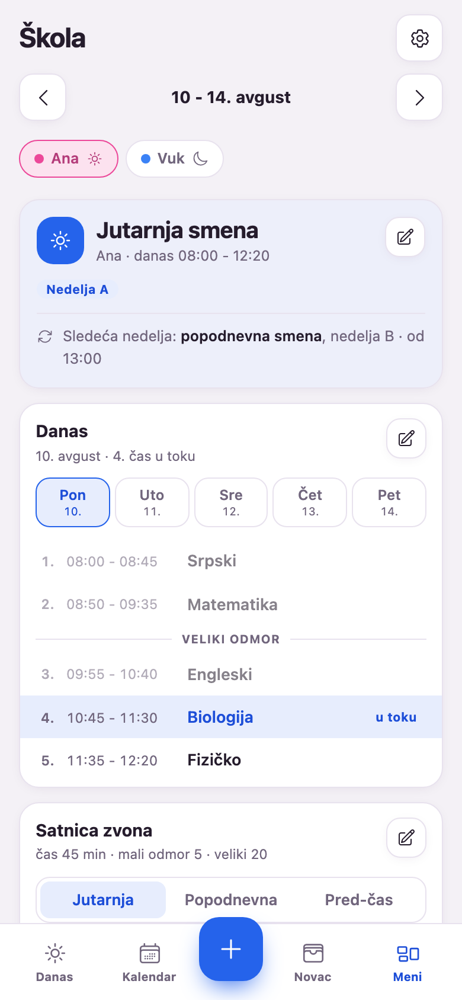     |         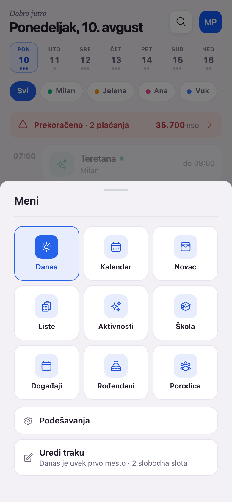          | 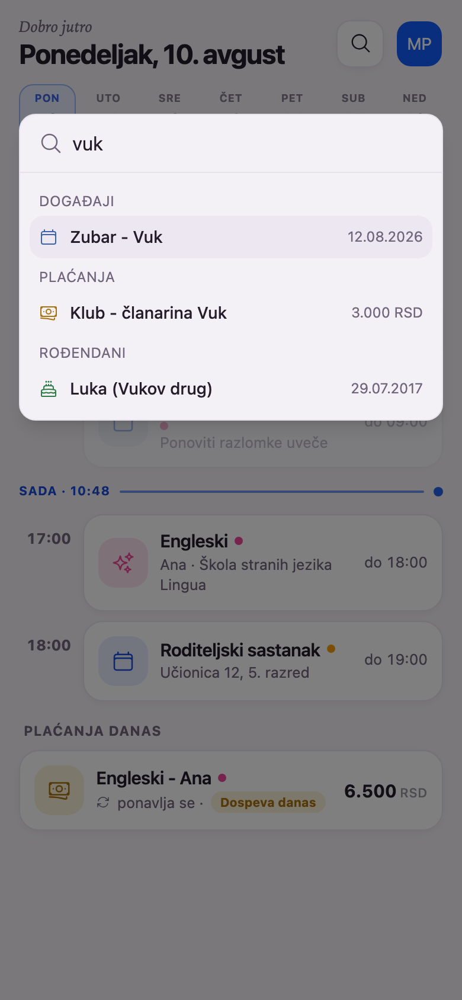 |
|                 **Kid mode**                 |                  **Kid schedule**                   |                 **Dark theme**                  |
| 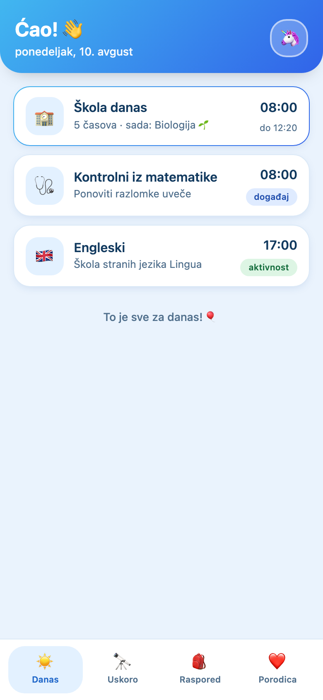 | 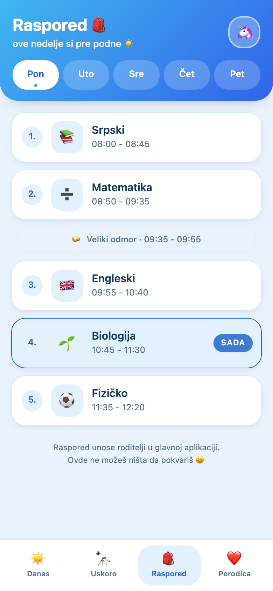 | 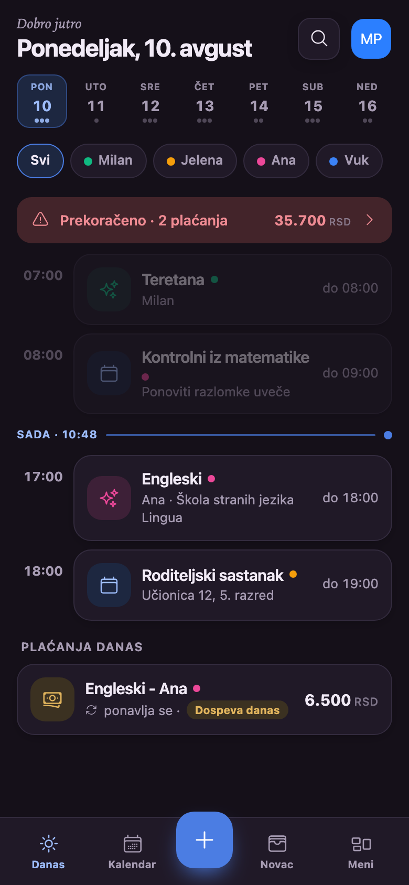  |

## Features

- 📅 **One agenda (Today / Calendar)** - activities, events, payments, birthdays and
  Google events in a single stream. The calendar is read as an agenda, a week or a month, with
  filters by type and by member, and everything missed sits at the top in the overdue section.
- 🎒 **Activities and the school timetable** - recurring sessions (weekly, A/B weeks, every N weeks),
  participants per member, plus school shifts that flip automatically, an A/B timetable
  and bell schedules that work out the time of every class on their own.
- 💳 **Payments** - one-off and recurring (monthly, weekly, a limited number of instalments),
  variable amounts, pausing, reminders N days ahead, and links to an activity,
  an event or a birthday (so a family can see what a hobby actually costs).
- 💱 **Multiple currencies** - an amount in EUR or USD is converted on entry at the official
  NBS middle rate and **frozen** together with that rate, so history is never re-converted.
- 📊 **Budget** - categories with monthly limits, income, an end-of-month projection,
  top shops and a spending trend. An expense is added by hand or by **scanning the fiscal QR code**
  (zxing-wasm in the browser, then pulling the receipt's line items).
- 📝 **Lists** - family-wide and personal, in realtime. Swipe actions, drag-and-drop ordering,
  markdown descriptions and a smart sort that groups a shopping list by aisle on its own.
- 🎂 **Birthdays** - ages, how many days are left, and linking a gift as a payment.
- 🔔 **Web Push** - a morning and an evening digest at the configured time and timezone,
  reminders before an event and an instant notification when someone in the house adds something.
  Idempotent through `notification_log`; dead subscriptions clean themselves up.
- 📆 **Google Calendar** - a one-way, read-only mirror with per-calendar privacy:
  not shared at all, only the time slot without details, or the whole event.
- 🧒 **Kid mode** - a child gets their own, entirely read-only app: what they have today, what is
  coming up soon and their school timetable, in a theme they pick themselves. A phone is linked
  with a QR code or an eight-character invite and then signs in with a PIN; there is no email and no
  password, and a parent can see the linked devices and revoke them at any time.
- 🔍 **Global search** (⌘K) across activities, events, payments, lists and birthdays.
- 📱 **PWA** - installs onto a phone, runs standalone, has a dark theme and
  a toast when a new version lands.
